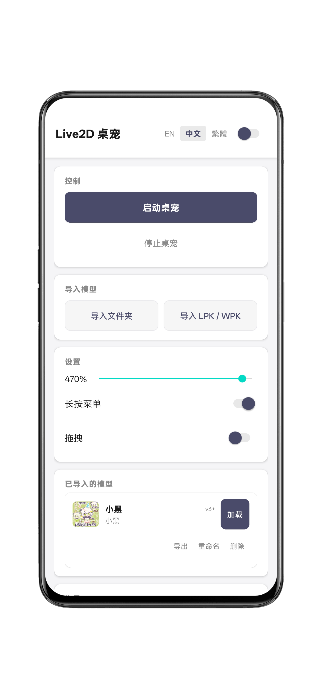

# DeskPet - Live2D Android Desktop Pet

[中文](README.md) | [English](README.en.md)

An Android Live2D desktop pet. Compatible with Live2DViewerEX model formats (json / LPK / WPK), renders as a persistent system overlay using native C++ and OpenGL ES 2.0.

**This app is recommended for preview purposes only. Some features are not fully polished (e.g., component toggles, drag components, sound playback, etc.). For the complete model experience, please use Live2DViewerEX.**

**This project may have some display bugs. For the complete model experience, please use Live2DViewerEX.**

**For the complete model experience, please use Live2DViewerEX.**

**This project must not be used for illegal purposes; it is for learning only.**

---

## DeskPet

### Desktop Overlay

- **Edge Hide** — Auto-hide at screen edge, adjustable visible portion
- **Click-Through** — Passes touch events to apps below, adjustable alpha
- **Auto Follow** — Model gaze follows touch position

### Other

- **Dark Mode** — Top bar toggle
- **Multi-Language** — English / Simplified Chinese / Traditional Chinese
- **HitArea Visualization** — Developer tool, red wireframe over touch areas
- **Independent drag/long-press toggles**
- **WPK/LPK model export**

---

## Base Features

Shared capabilities with Live2DViewerEX (not elaborated):

- Cubism 2 / 3 / 4 / 5 rendering
- Physics simulation (hair, cloth, adjustable weight)
- Expression switching & blending (Cubism2: Overwrite / Add / Multiply)
- HitArea touch (tap regions to trigger motions or toggle components)
- Component toggle (Groups-based clothing/accessory cycling)
- Random speech (idle auto-play with text bubble)
- Model management (rename/export/delete)
- Folder import (SAF), LPK/WPK import, Steam Workshop support

---

## Project Structure

```
deskpet/
├── app/src/main/java/com/muxiao/deskpet/
│   ├── MainActivity.java           # Main UI
│   ├── FloatingWindowService.java  # Overlay service
│   ├── ActionMenuManager.java      # Long-press menu
│   ├── EdgeHideManager.java        # Edge-hide at screen border
│   ├── TextBubbleOverlay.java      # Text bubble overlay
│   ├── MotionSoundPlayer.java      # Sound playback
│   ├── ModelImporter.java          # Model import (SAF / LPK / WPK)
│   ├── LpkUnpacker.java            # LPK/WPK decryption
│   ├── FileUtils.java              # File utilities
│   └── live2d/Live2DNativeBridge.java
├── app/src/main/cpp/
│   ├── LAppLive2DManager.cpp       # Model mgmt, HitArea, mirror/rotation
│   ├── LAppModel.cpp               # Cubism 3/4/5 model loading & rendering
│   ├── LAppModelCubism2.cpp        # Cubism 2 model loading & rendering
│   ├── ControllerEngine.cpp        # Parameter controller engine
│   ├── ModelConfigParser.cpp       # config.mlve / model3.json parser
│   ├── MotionSequencer.cpp         # Motion sequencing, VarFloat, toggle groups
│   ├── LAppDelegate.cpp            # App lifecycle, OpenGL init
│   ├── LAppView.cpp                # Touch events & render view
│   ├── JniBridgeC.cpp              # Java ↔ C++ JNI bridge
│   ├── Cubism2MocLoader.cpp        # Cubism 2 moc file loader
│   ├── RandomSpeaker.cpp           # Random speech
│   └── LAppPal.cpp                 # Platform abstraction (time, path, log)
├── Core/                           # Live2D Cubism SDK
├── Framework/                      # [submodule] Cubism Native Framework
└── Samples/                        # [submodule] Cubism Native Samples
```

---

## License

This project is for educational and research purposes only. The use of Live2D Cubism SDK is subject to the [Live2D License Agreement](https://www.live2d.com/eula/live2d-open-software-license-agreement_en.html).

GNU GENERAL PUBLIC LICENSE Version 3

---

## Preview


